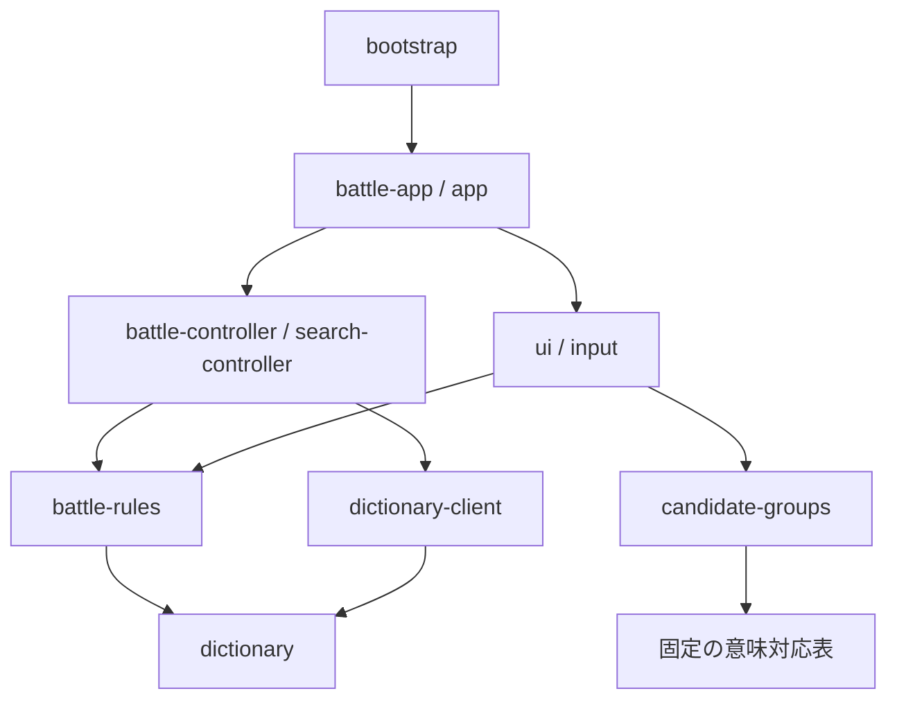

# 構成と責務

ブラウザーはES Modules、生成・検証はNode.jsとPythonです。新しいframeworkや実行時依存は使いません。既存の規則・制御・辞書取得の境界は維持し、画面と起動の責務を分けています。

| 場所 | 責務と変更するときの入口 |
| --- | --- |
| `web/bootstrap.mjs` | 唯一のページ起動。2画面のmount、独立した辞書クライアント、タブの表示と対戦中のロック、破棄 |
| `web/battle-app.mjs` | 操作イベント、controllerの通知とviewの更新順序、UIの開閉状態、100msのtickと破棄 |
| `web/ui/battle-view.mjs` | 設定・手渡し・入力・成功・結果・降参確認のDOM描画。通信・残り時間の計算はしない |
| `web/ui/battle-feedback.mjs` | 時計の表示、再描画前後のフォーカス・スクロール維持、装飾用文字の飛行 |
| `web/input/transform-kana.mjs` | 末尾の濁音・半濁音・小書き切替。消費の採否はrulesで検査 |
| `web/battle-controller.mjs` | ready/typing/checking/error/success/finishedの遷移、残り時間、遅延応答の無効化 |
| `web/battle-rules.mjs` | ゲーム設定、入力検査、文字消費と確定。「辞書にあるか」の通信はしない |
| `web/app.mjs`、`web/search-controller.mjs` | 辞書のフォーム・IME・結果描画と、最新検索のみを通知する制御 |
| `web/dictionary-client.mjs` | manifest・区画の遅延取得、ハッシュ/サイズ/版/参照先の検証、再試行時の再検証 |
| `web/candidate-groups.mjs`、`web/ui/candidate-summary.mjs` | 出典照合による表示カード集約と成功表示の最大2件。ゲーム採否は変更しない |
| `web/meaning-equivalences.mjs`、fixtures、JSON | 固定の照合済みデータ・テストデータ。サイズだけで分割や再生成をしない |
| `dictionary.mjs`、`reading-bucket.mjs` | 既存の辞書採否・読み索引・区画選択。固定辞書再利用時はバイト一致が必要 |
| `import-jawiktionary.mjs`、`build.mjs`、`build-web-dictionary.mjs` | 原資料の取り込み、監査、256区画の辞書生成 |
| `build-web.mjs`、`package-site.py`、`verify-site.mjs` | 検証した辞書を使ったサイト構築、再現可能な分割ZIP包装、配布検証 |
| `scripts/release-assets.json`、`.mjs` | Node/Python共通のソース一覧と公開allowlist。新しい配布moduleはここへ追加 |
| `scripts/source-files.mjs`、`check-syntax.mjs`、`test.mjs` | ルート・web・scriptsの全 `.mjs` を探索し、構文検査とテストで同じ範囲を使う。distの退避ソースは混ぜない |
| `docs/`、`publish/`、`dist/` | 契約文書、追跡する配布物、Git対象外のローカル生成・検証出力 |

DOM依存をUIに置き、ルールと対戦制御はdocumentなしでも検証できます。描画が所有するのはDOMです。対戦状態・時刻・確認tokenはcontroller、相手文字/降参確認の開閉と入力演出の開始位置はbattle-appが所有します。viewは描画時の値と通知関数を受け取ります。装飾演出を待ってゲームを進めることはありません。

公開関数のJSDocは日本語で、入力・出力・副作用・例外を記します。従来の `app.mjs` の `createSearchController`、`battle-app.mjs` の `summarizeCandidates` と `transformLastKana` は再exportしてimport互換性を保ちます。画面moduleをimportするだけでは起動しません。HTMLからの起動はbootstrapだけです。

変更箇所に対応するテストは同名の `.test.mjs`。DOMではlinkedom、通信ではfetchの注入、時刻ではnowの注入を使います。fixturesの語義はテスト用で、実辞書へ流用しません。UI再描画では使用済みキーを避けてフォーカスを復元し、盤面スクロールを保持します。かな飛行・紙吹雪は装飾として隠し、prefers-reduced-motionを尊重します。
